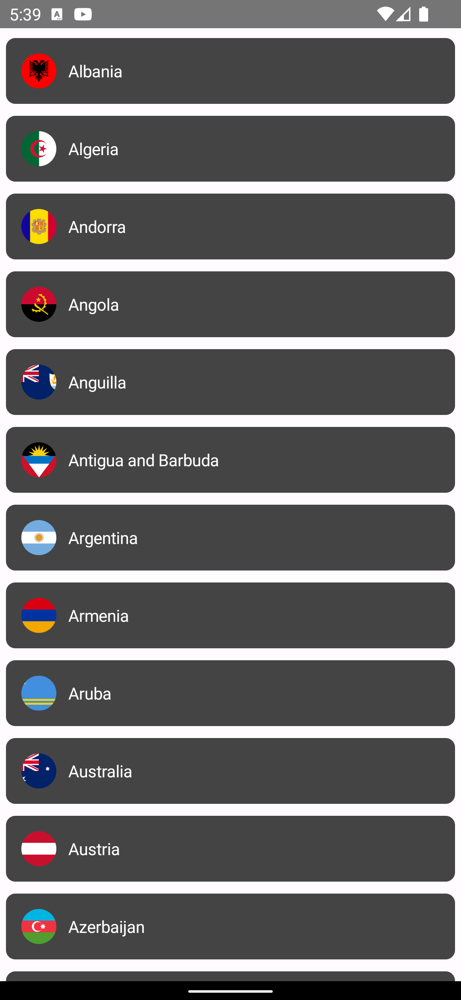
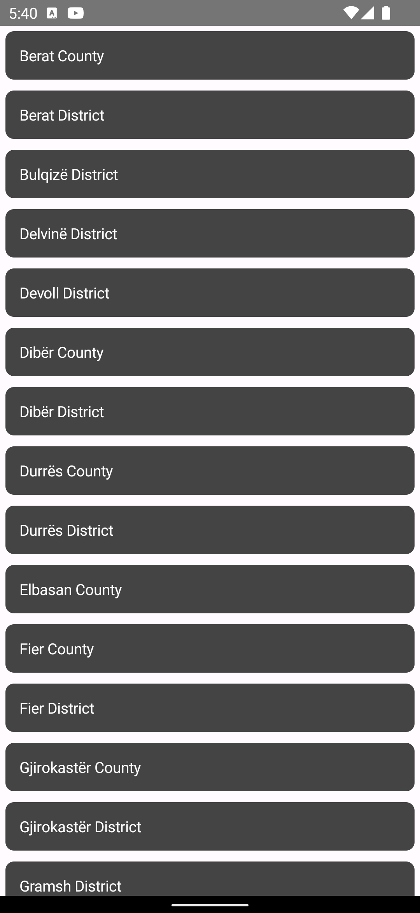

# RetrofitSample (Jetpack Compose, MVVM, Dagger Hilt)
A sample application which loads the countries and states using API provided by PostMan

This sample showcases:
* Retrofit integration on a compose application
* Integration with an existing architecture based on Jetpack libraries.
* UI Unit test case of compose view
* Navigation graph of compose view

## Screenshots

